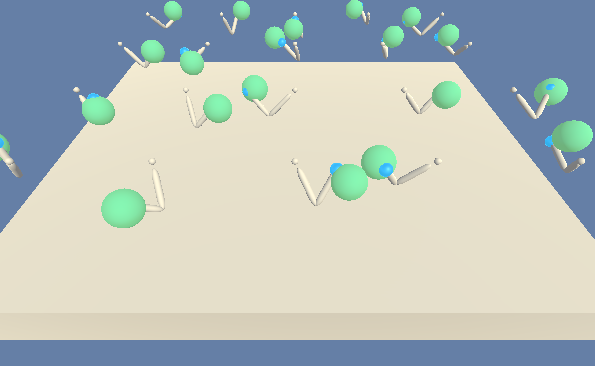

# Continuous Control



## Goal
To build a deep reinforcement learning agent that controls 20 robotic arms to maintain contact with the green balls. A reward of +0.1 is provided for each timestep when the agent's hand is in contact with the green balls. The environment is considered solved when the agents achive a mean score of +30.

## Learning Algorithm

### Deep Deterministic Policy Gradient (DDPG)
The DDPG algorithm is a modification to the deterministic policy gradient (DPG) algorithm ([Silver et al., 2014](http://proceedings.mlr.press/v32/silver14.html)). In DDPG, neural network function approximators are used to learn in large state and action spaces online. As in deep Q network (DQN), introducing non-linear function approximators means that convergence is no longer guaranteed. However, such approximators appear essential in order to learn and generalize on large state spaces. The [DDPG template](https://github.com/udacity/deep-reinforcement-learning/tree/master/ddpg-pendulum) provided in the ND repo was used to develop the algorithm.  

### Replay buffer
One challenge when using neural networks for reinforcement learning is that most optimization algorithms assume that the samples are independently and identically distributed. Obviously, when the samples are generated from exploring sequentially in an environment this assumption no longer holds. Additionally, to make efficient use of hardware optimizations, it is essential to learn in minibatches, rather than online. 

To address those issues, DDPG uses a replay buffer, which is a finite sized cache. Transitions were sampled from the environment according to the exploration policy and the tuple (s_t, a_t, r_t, s_{t+1}) was stored in the replay buffer. When the replay buffer was full the oldest samples were discarded. At each timestep the actor and critic are updated by sampling a minibatch uniformly from the buffer. Because DDPG is an off-policy algorithm, the replay buffer can be large, allowing the algorithm to benefit from learning across a set of uncorrelated transitions.

Related parameters:
```
BUFFER_SIZE = int(1e6) # replay buffer size
```

### Soft updates
Directly implementing Q learning with neural networks tends to be unstable in many environments. Since the network Q being updated is also used in calculating the target value, the Q update is prone to divergence. 

The DDPG algorithm uses a solution similar to the target network used in [Mnih et al., 2013](https://arxiv.org/abs/1312.5602.pdf) but modified for actor-critic and using ‘soft’ target updates, rather than directly copying the weights. The weights of these target networks are then updated by having them slowly track the learned networks with a coefficient Tau. This means that the target values are constrained to change slowly, greatly improving the stability of learning. This simple change moves the relatively unstable problem of learning the action-value function closer to the case of supervised learning, a problem for which robust solutions exist. 

Related parameters:
```
TAU = 1e-3 # for soft update of target parameters
```

### Batch normalization
When learning from low dimensional feature vector observations, the different components of the observation may have different physical units (for example, positions versus velocities) and the ranges may vary across environments. This can make it difficult for the network to learn effectively and may make it difficult to find hyper-parameters which generalise across environments with different scales of state values.

The DDPG algorithm addresses this issue by adapting a recent technique from deep learning called batch normalization [Ioffe and Szegedy, 2015]( https://arxiv.org/abs/1502.03167.pdf). This technique normalizes each dimension across the samples in a minibatch to have unit mean and variance. In addition, it maintains a running average of the mean and variance to use for normalization during testing (in our case, during exploration or evaluation). In deep networks, it is used to minimize covariance shift during training, by ensuring that each layer receives whitened input. In the low-dimensional case, we used batch normalization on the state input and all layers of the mu network and all layers of the Q network prior to the action input. 

Related parameters:
```
BATCH_SIZE = 128 # minibatch size
```
### Exploration
The DDPG algorithm uses an Ornstein-Uhlenbeck process ([Uhlenbeck and Ornstein, 1930](https://journals.aps.org/pr/abstract/10.1103/PhysRev.36.823)) to generate temporally correlated exploration for exploration efficiency in physical control problems with inertia.

Related parameters:
```
OU_SIGMA = 0.2          # Ornstein-Uhlenbeck noise parameter
OU_THETA = 0.15         # Ornstein-Uhlenbeck noise parameter
EPSILON = 1.0           # explore->exploit noise process added to act step
EPSILON_DECAY = 1e-6    # decay rate for noise process
```

### Learning Interval [(code)](https://github.com/ashikagah/DRLND_Continuous_Control/blob/master/ddpg_agent.py)
The learning timestep interval was set to 20 to avoid slow learning. The algorithm samples experiences from the buffer and learns 10 times.

Related parameters:
```
LEARN_EVERY = 20        # learning timestep interval
LEARN_NUM = 10          # number of learning passes
```

### Model architecture
Both the actor and critic networks have two fully connected hidden layers, the first layer with 512 nodes and the second layer with 256 nodes. The actor network uses the tanh() activation function to limit all actions within the [-1, +1] range. When updating the critic network, it uses gradient clipping to place an upper limit on the size of the parameter updates.

## Plot of Rewards


## Ideas for Future Work
Other algorithms such as [Asynchronous Advantage Actor-Critic (A3C)](https://arxiv.org/abs/1611.02247), [Advantage Actor-Critic (A2C)](https://openai.com/blog/baselines-acktr-a2c/), or [Generalized Advantage Estimation (GAE)](https://arxiv.org/abs/1506.02438) should be explored.


